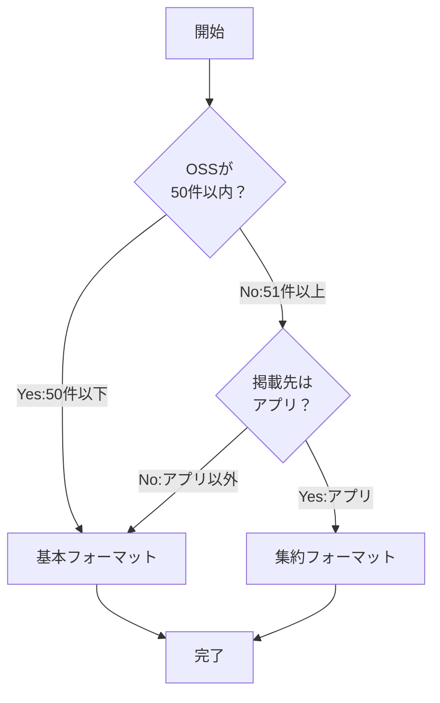
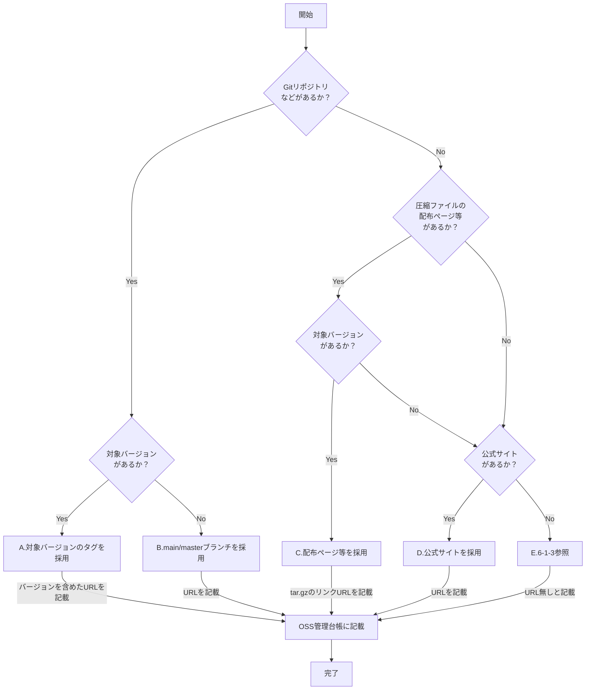
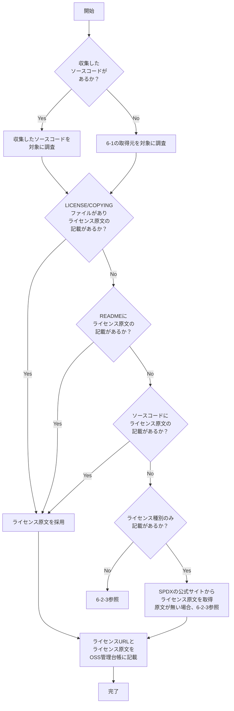
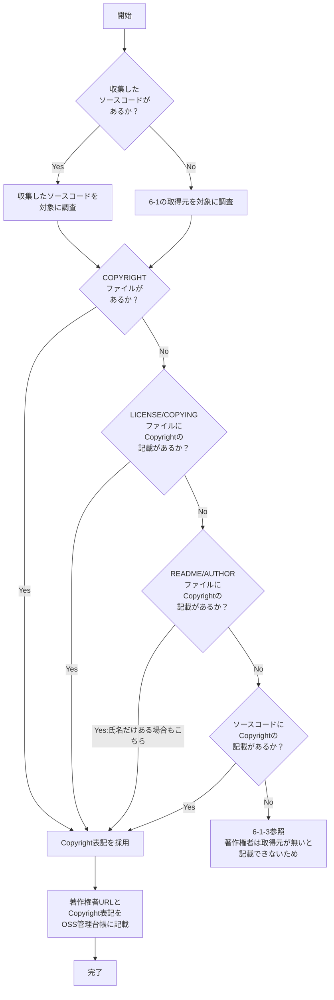
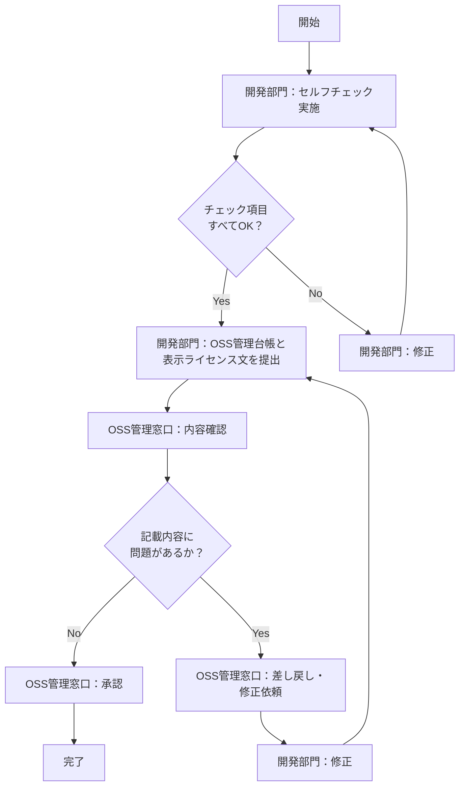

# OSSライセンス表示対応ガイドライン
## 目次
1. 目的
2. 適用範囲
3. 用語
4. OSS管理台帳の記載ルール
5. テキストフォーマット
6. 調査フロー
　6-1. 取得元の選定（優先順位）
　6-2. ライセンスの調査
　6-3. 著作権者の調査
7. 提出・確認フロー
8. エスカレーション

---

## 1. 目的

本ガイドラインは、<u>**頒布する製品**</u> に組み込むOSS（オープンソースソフトウェア）の<u>**ライセンス表示対応**</u> を、<u>**開発部門が正確かつ効率的に実施できるようにすることを目的**</u> とする。

OSSの利用にあたっては、各ライセンスが定める以下の表示義務を履行する必要がある。

- ライセンス文の表示
- 著作権者の表示
- 非保証・免責事項の表示

これらは法的義務であり、対応が不十分な場合はライセンス違反となるリスクがある。

---

## 2. 適用範囲

### 2-1. 適用範囲

本ガイドラインは、以下を対象とする。

- <u>**頒布する製品**</u> に組み込むすべてのOSS
- 依存関係にある全てのOSSを含む（SCA解析結果に基づく）

また、本ガイドラインは以下の組織でのみ公開可能とし、<u>**他事業部への公開は不可**</u> とする。

- 事業部外で本ガイドラインを参照して作られたルールなどに基づいて作成された<u>**文章に問題が発生した際、責任が取れないため**</u> 、<u>**参考情報としての開示も禁止**</u> とする。


### 2-2. 適用時期

以下のタイミングで、解析結果レポートの構成管理に基づき管理台帳へ表示する文章を記載し、表示するライセンス文を作成すること。

| 開発対象 | タイミング |
|-----------|---------|
| 新商品 | まで |
| 設計変更 | まで |

### 2-3. 提出時期・提出先

- 提出時期：資料配布 2週間前
- 提出先：OSS管理窓口（URL）
- 時期の理由：管理台帳、および表示するライセンス文の修正に時間を要する可能性があるため

---

## 3. 用語

| 用語 | 定義 |
|------|------|
| OSS | オープンソースソフトウェア。オープンソースの定義（OSD）に準拠した<br>ライセンスのもとで公開されているソフトウェア。 |
| ライセンス | OSSの利用・複製・配布等に関する利用条件。<br>MITライセンス、Apache-2.0等の種別がある。 |
| ライセンス原文 | OSSの配布物やリポジトリに含まれるLICENSEファイル等、<br>OSSの開発者・配布者が公開しているライセンスの原本ファイル。<br>調査・参照の対象となる。 |
| 表示ライセンス文 | ライセンス原文をもとに、製品への掲載用として作成したテキスト。<br>本ガイドラインのフォーマットに従って作成する。 |
| 著作権者 | OSSの著作権を保有する個人または組織。<br>Copyright表記として記載されているものを指す。 |
| 非保証・免責事項 | OSSの利用に際して、開発者が保証・責任を負わない旨を定めた条項。<br>多くのライセンスにおいてライセンス原文に含まれる。 |
| SCA解析 | ソフトウェアコンポジション解析（Software Composition Analysis）。<br>製品に含まれるOSSおよびその依存関係を特定するための解析。<br>本運用ではBlack Duckを使用する。 |
| OSS管理台帳 | OSSの情報を一元管理するExcelファイル。<br>OSS名・バージョン・ライセンス等を記載する。<br>また、ライセンス原文や著作権者の取得元を記載する。 |

---

## 4. OSS管理台帳の記載ルール

### 4-1. 目的

OSS管理台帳は、OSSのライセンス表示対応を正確に行うための情報を一元管理し、
以下を目的として記載・保管する。

- ライセンス表示対応の根拠を明確にするため
- 調査内容の再現性を確保するため
- <u>**問い合わせ・監査等に対して速やかに根拠を示すため**</u>

### 4-2. 記載項目

OSS管理台帳の "構成管理【付図1】" には以下の項目を記載すること。

| 項目 | 内容 | 列 | 記載例 |
|------|------|---|--------|
| OSS名 | OSSの正式名称 | B | curl |
| バージョン | 採用しているバージョン | B | 8.5.0 |
| ライセンス | ライセンス種別 | E | curl license |
| 取得元URL | OSSの配布元・リポジトリURL | C | https://github.com/curl/curl |
| 著作権者URL | 著作権者を確認したファイルのURL | D | https://github.com/curl/curl/blob/curl-8_5_0/COPYING |
| ライセンスURL | ライセンス原文を確認したファイルのURL | D | https://github.com/curl/curl/blob/curl-8_5_0/COPYING |
| 著作権者 | Copyright表記をそのまま転記 | D | Copyright (c) 1996-2024, Daniel Stenberg |
| ライセンス原文 | ライセンス原文のテキスト | D | （原文を貼り付け） |
| 判断理由 | 上記URLを採用した根拠 | D | GitHubのv8.5.0タグのCOPYINGファイルを参照 |

### 4-3. 記載上の注意

- 著作権者は原文の表記をそのまま転記すること（表記を変えない）
- 複数の著作権者がいる場合はすべて列挙すること
- URLは実際にアクセスできることを確認してから記載すること
- バージョンを変更した場合は、各項目を必ず見直すこと
- 著作権者URLとライセンスURLは、同一ファイルに両方が含まれる場合、同じURLになることがある。
- 判断理由が選択肢にない場合、右の列に自由記述で記載すること

---

## 5. 表示ライセンス文のフォーマット

当事業部において表示ライセンス文は本フォーマットのみとする。
※ 既に発行済の文章は変更不要とし、今後新規作成する際は本フォーマットに沿うものとする。

### 5-1. 基本フォーマット

OSSごとに著作権者・ライセンス原文をまとめて記載する。原則このフォーマットを使用すること。

```
================================================================
OSS名
Copyright: （Copyright表記をそのまま転記、複数行あるなら改行して良い）
License: （ライセンス種別）
---
ライセンス原文

================================================================
OSS名
Copyright: （Copyright表記をそのまま転記、複数行あるなら改行して良い）
License: （ライセンス種別）
---
ライセンス原文
```

#### 5-1-1. 基本フォーマットの記載例

```
================================================================
curl(8.5.0)
Copyright: Copyright (c) 1996 - 2023, Daniel Stenberg, <daniel@haxx.se>, and many
contributors, see the THANKS file.
License: curl license
---
COPYRIGHT AND PERMISSION NOTICE

Copyright (c) 1996 - 2023, Daniel Stenberg, <daniel@haxx.se>, and many
contributors, see the THANKS file.

All rights reserved.

Permission to use, copy, modify, and distribute this software for any purpose
with or without fee is hereby granted, provided that the above copyright
notice and this permission notice appear in all copies.

THE SOFTWARE IS PROVIDED "AS IS", WITHOUT WARRANTY OF ANY KIND, EXPRESS OR
IMPLIED, INCLUDING BUT NOT LIMITED TO THE WARRANTIES OF MERCHANTABILITY,
FITNESS FOR A PARTICULAR PURPOSE AND NONINFRINGEMENT OF THIRD PARTY RIGHTS. IN
NO EVENT SHALL THE AUTHORS OR COPYRIGHT HOLDERS BE LIABLE FOR ANY CLAIM,
DAMAGES OR OTHER LIABILITY, WHETHER IN AN ACTION OF CONTRACT, TORT OR
OTHERWISE, ARISING FROM, OUT OF OR IN CONNECTION WITH THE SOFTWARE OR THE USE
OR OTHER DEALINGS IN THE SOFTWARE.

Except as contained in this notice, the name of a copyright holder shall not
be used in advertising or otherwise to promote the sale, use or other dealings
in this Software without prior written authorization of the copyright holder.

================================================================
proxy-from-env(2.0.0)
Copyright: Copyright (C) 2016-2018 Rob Wu <rob@robwu.nl>
License: MIT
---
The MIT License

Copyright (C) 2016-2018 Rob Wu <rob@robwu.nl>

Permission is hereby granted, free of charge, to any person obtaining a copy of
this software and associated documentation files (the "Software"), to deal in
the Software without restriction, including without limitation the rights to
use, copy, modify, merge, publish, distribute, sublicense, and/or sell copies
of the Software, and to permit persons to whom the Software is furnished to do
so, subject to the following conditions:

The above copyright notice and this permission notice shall be included in all
copies or substantial portions of the Software.

THE SOFTWARE IS PROVIDED "AS IS", WITHOUT WARRANTY OF ANY KIND, EXPRESS OR
IMPLIED, INCLUDING BUT NOT LIMITED TO THE WARRANTIES OF MERCHANTABILITY, FITNESS
FOR A PARTICULAR PURPOSE AND NONINFRINGEMENT. IN NO EVENT SHALL THE AUTHORS OR
COPYRIGHT HOLDERS BE LIABLE FOR ANY CLAIM, DAMAGES OR OTHER LIABILITY, WHETHER
IN AN ACTION OF CONTRACT, TORT OR OTHERWISE, ARISING FROM, OUT OF OR IN
CONNECTION WITH THE SOFTWARE OR THE USE OR OTHER DEALINGS IN THE SOFTWARE.

================================================================
follow-redirects(1.16.0)
Copyright: Copyright 2014–present Olivier Lalonde <olalonde@gmail.com>, James Talmage <james@talmage.io>, Ruben Verborgh
License: MIT
---
Copyright 2014–present Olivier Lalonde <olalonde@gmail.com>, James Talmage <james@talmage.io>, Ruben Verborgh

Permission is hereby granted, free of charge, to any person obtaining a copy of
this software and associated documentation files (the "Software"), to deal in
the Software without restriction, including without limitation the rights to
use, copy, modify, merge, publish, distribute, sublicense, and/or sell copies
of the Software, and to permit persons to whom the Software is furnished to do
so, subject to the following conditions:

The above copyright notice and this permission notice shall be included in all
copies or substantial portions of the Software.

THE SOFTWARE IS PROVIDED "AS IS", WITHOUT WARRANTY OF ANY KIND, EXPRESS OR
IMPLIED, INCLUDING BUT NOT LIMITED TO THE WARRANTIES OF MERCHANTABILITY,
FITNESS FOR A PARTICULAR PURPOSE AND NONINFRINGEMENT. IN NO EVENT SHALL THE
AUTHORS OR COPYRIGHT HOLDERS BE LIABLE FOR ANY CLAIM, DAMAGES OR OTHER LIABILITY,
WHETHER IN AN ACTION OF CONTRACT, TORT OR OTHERWISE, ARISING FROM, OUT OF OR
IN CONNECTION WITH THE SOFTWARE OR THE USE OR OTHER DEALINGS IN THE SOFTWARE.

```

### 5-2. 集約フォーマット

ライセンス原文が完全に一致している場合、ライセンス原文をまとめて記載する。

#### 5-2-1. 同一ライセンス原文の集約

スマホアプリなどでテキスト表示に時間がかかることがあるため、複数のOSSのライセンス原文が
完全に一致する場合、１つにまとめて記載してよい。
その場合、対象OSSを明示すること。（記載例は 集約フォーマットの記載例 参照）

```
[Copyrights]
================================================================
OSS名
    （OSS管理台帳に記載したCopyright表記をそのまま転記、複数行あるなら改行して良い）
OSS名
    （OSS管理台帳に記載したCopyright表記をそのまま転記、複数行あるなら改行して良い）


[Licenses]
================================================================
----------------------------------------------------------------------
（ライセンス種別）
    OSS名, OSS名:
----------------------------------------
（ライセンス原文）

----------------------------------------------------------------------
（ライセンス種別）
    OSS名, OSS名:
----------------------------------------
（ライセンス原文）

```

#### 5-2-2. 集約フォーマットの記載例

proxy-from-env(2.0.0)とfollow-redirects(1.16.0)はライセンス原文が一致しているため、
ライセンス表示義務を１つの文章で履行できる。
そのため、以下のように集約することができる。

```
[Copyrights]
================================================================
curl(8.5.0)
    Copyright (c) 1996 - 2023, Daniel Stenberg, <daniel@haxx.se>, and many contributors, see the THANKS file.
proxy-from-env(2.0.0)
    Copyright (C) 2016-2018 Rob Wu <rob@robwu.nl>
follow-redirects(1.16.0)
    Copyright 2014–present Olivier Lalonde <olalonde@gmail.com>, James Talmage <james@talmage.io>, Ruben Verborgh


[Licenses]
================================================================
----------------------------------------------------------------------
MIT
    curl(8.5.0):
----------------------------------------
COPYRIGHT AND PERMISSION NOTICE

Copyright (c) 1996 - 2023, Daniel Stenberg, <daniel@haxx.se>, and many
contributors, see the THANKS file.

All rights reserved.

Permission to use, copy, modify, and distribute this software for any purpose
with or without fee is hereby granted, provided that the above copyright
notice and this permission notice appear in all copies.

THE SOFTWARE IS PROVIDED "AS IS", WITHOUT WARRANTY OF ANY KIND, EXPRESS OR
IMPLIED, INCLUDING BUT NOT LIMITED TO THE WARRANTIES OF MERCHANTABILITY,
FITNESS FOR A PARTICULAR PURPOSE AND NONINFRINGEMENT OF THIRD PARTY RIGHTS. IN
NO EVENT SHALL THE AUTHORS OR COPYRIGHT HOLDERS BE LIABLE FOR ANY CLAIM,
DAMAGES OR OTHER LIABILITY, WHETHER IN AN ACTION OF CONTRACT, TORT OR
OTHERWISE, ARISING FROM, OUT OF OR IN CONNECTION WITH THE SOFTWARE OR THE USE
OR OTHER DEALINGS IN THE SOFTWARE.

Except as contained in this notice, the name of a copyright holder shall not
be used in advertising or otherwise to promote the sale, use or other dealings
in this Software without prior written authorization of the copyright holder.

----------------------------------------------------------------------
MIT
    proxy-from-env(2.0.0), follow-redirects(1.16.0):
----------------------------------------
Permission is hereby granted, free of charge, to any person obtaining a copy of
this software and associated documentation files (the "Software"), to deal in
the Software without restriction, including without limitation the rights to
use, copy, modify, merge, publish, distribute, sublicense, and/or sell copies
of the Software, and to permit persons to whom the Software is furnished to do
so, subject to the following conditions:

The above copyright notice and this permission notice shall be included in all
copies or substantial portions of the Software.

THE SOFTWARE IS PROVIDED "AS IS", WITHOUT WARRANTY OF ANY KIND, EXPRESS OR
IMPLIED, INCLUDING BUT NOT LIMITED TO THE WARRANTIES OF MERCHANTABILITY, FITNESS
FOR A PARTICULAR PURPOSE AND NONINFRINGEMENT. IN NO EVENT SHALL THE AUTHORS OR
COPYRIGHT HOLDERS BE LIABLE FOR ANY CLAIM, DAMAGES OR OTHER LIABILITY, WHETHER
IN AN ACTION OF CONTRACT, TORT OR OTHERWISE, ARISING FROM, OUT OF OR IN
CONNECTION WITH THE SOFTWARE OR THE USE OR OTHER DEALINGS IN THE SOFTWARE.

```

### 5-3. フォーマットの選択基準

以下のフローに従いフォーマットを選択すること。
「スマホアプリなどテキスト表示に時間がかかる」など、明確な理由がある場合に限り集約可能とする。



### 5-4. ファイル分割する場合のルール

ファイル分割する場合は以下のファイル構成とすること。

| ファイル名 | 内容 |
|-----------|------|
| oss_copyright.txt | 著作権者のみ |
| oss_license.txt | ライセンス原文のみ |

---

## 6. 調査フロー

### 6-1. 取得元
#### 6-1-1. 選定

ライセンス原文・著作権者の調査に使用する取得元は、以下の優先順位に従い選定すること。
選定した取得元とその判断理由をOSS管理台帳に記載すること。

| 優先順位 | 取得元 | 説明 |
|---------|--------|------|
| 1 | ダウンロードしたソースコード<br>（取得ソースコード） | 実際に製品に組み込んだものと同一のため最優先 |
| 2 | Gitの対象バージョンのタグ | バージョンが明確に特定できる<br>SourceForgeやnpmなどwebで公開されている情報も含む |
| 3 | Gitのmain/masterブランチ | タグが存在しない場合に使用<br>SourceForgeやnpmなどwebで公開されている情報も含む |
| 4 | 配布ページ等 | webでソースコードが公開されていない場合に使用<br>組み込みLinuxのOSSでtar.gzなど圧縮された状態で配布されている |
| 5 | 公式サイト等 | 上記いずれにも該当しない場合に使用 |


以下のフローに従い取得元を選定すること。



#### 6-1-2. OSS管理台帳への記載

OSS管理台帳のxx列に取得元URLを記載すること。

#### 6-1-3. 追加調査

以下に該当するならばOSSの利用を許容する。

- ライセンス、著作権者、非保障免責事項の表示義務が無いライセンスであれば利用を許容（Public Domainなど）
- ライセンス、著作権者、非保障免責事項の表示義務があるがソースコードに著作権者が記載されているならば利用を許容（ライセンス・非保障免責事項は原文を採用する）
    - 著作権者は COPYRIGHT ファイル以外に、LICENSE/COPYING/README/AUTHOR/ソースコードのヘッダ などに記載されているケースがあるため、grepなどで確認すること

該当しなければ、頒布するための利用条件を履行できずコンプライアンス違反となるため、利用を禁止する。
その場合の対策案は以下とする。

1. 該当するOSSを別のOSSに代替する
2. 該当するOSSの開発者への連絡先が明確ならば、EW OSS事務局に連絡して良いか確認したうえで、連絡をする

### 6-2. ライセンスの調査

#### 6-2-1. 選定

6-1で選定した取得元からライセンス原文を調査すること。
調査したライセンス原文とその判断理由をOSS管理台帳に記載すること。

以下のフローに従いライセンス原文を調査すること。



#### 6-2-2. OSS管理台帳への記載

OSS管理台帳のxx列にライセンスURLを、xx列にライセンス原文を、xx列に採用理由を記載すること。
もし、tar.gzに含まれているならば、ライセンスURLは "取得元URLでダウンロードしたファイルの[ファイル名]" と記載すること。

#### 6-2-3. 追加調査

以下の場合、OSS管理窓口に相談をお願いします。

- ライセンス種別が明記されていない
- ライセンス種別が明記されているが、webに原文が無い

### 6-3. 著作権者の調査

#### 6-3-1. 選定

6-1で選定した取得元から著作権者を調査すること。
調査した著作権者とその判断理由をOSS管理台帳に記載すること。

以下のフローに従い著作権者を調査すること。



#### 6-3-2. OSS管理台帳への記載

OSS管理台帳のxx列に著作権者URLを、xx列に著作権者を記載すること。
著作権者が複数いる場合はすべて列挙すること。

---

## 7. 提出・確認フロー

### 7-1. 提出前セルフチェック

OSS管理台帳および表示ライセンス文を提出する前に、以下を確認すること。

| # | 確認項目 |
|---|---------|
| 1 | OSS管理台帳の全項目が記載されているか（空欄がないか） |
| 2 | 取得元URLに実際にアクセスできるか |
| 3 | 著作権者URLとライセンスURLがバージョンと一致しているか |
| 4 | 著作権者はCopyright表記をそのまま転記しているか |
| 5 | 複数の著作権者がいる場合、すべて列挙されているか |
| 6 | 表示ライセンス文のフォーマットは5章に従っているか |
| 7 | 判断理由が全項目に記載されているか |

### 7-2. 提出・確認フロー



### 7-3. 提出期限

2章（適用範囲・適用時期）に定める期限に従うこと。
期限を守れない場合は、事前にOSS管理窓口に連絡すること。

---

## 8. 問い合わせ先

### 8-1. 問い合わせが必要なケース

以下に該当する場合は、自己判断せずOSS管理窓口に連絡すること。

| # | ケース | 例 |
|---|--------|-----|
| 1 | 著作権者が特定できない | Copyright表記がどこにも見当たらない |
| 2 | ライセンスが特定できない | ライセンス種別の記載がどこにも見当たらない |
| 3 | ライセンス原文が取得できない | SPDXにも原文が存在しない |
| 4 | 複数のライセンスが混在している | LICENSEファイルとREADMEで異なるライセンスが記載されている |
| 5 | ライセンスの表示義務が判断できない | 見慣れないライセンス種別で表示義務が不明 |
| 6 | OSSの利用可否の判断が必要 | 6-1-3に該当し、利用禁止の可能性がある |

### 8-2. 問い合わせ先・連絡方法

- **連絡先**：OSS管理窓口（URL）
- **連絡方法**：〇〇（メール／チケット等）
- **連絡時に記載する内容**：
  - OSS名・バージョン
  - 該当するケース（上表の番号）
  - 調査した内容と判断に迷っている理由

### 8-3. 回答期限の目安

問い合わせを受けた場合、OSS管理窓口は受領から〇営業日以内に回答する。
回答が提出期限に間に合わない可能性がある場合は、OSS管理窓口から開発部門に連絡する。

---

## 更新履歴

| バージョン | 更新日 | 更新者 | 更新内容 |
|-----------|--------|--------|---------|
| 1.0 | YYYY/MM/DD | 〇〇部 | 初版作成。開発部門におけるOSSライセンス表示対応の作業標準化を目的として策定。 |
|  |  |  | 詳細：過去に開発部門から提出された表示内容について、記載すべき情報の所在が不明確、または記載内容の根拠が確認できないケースが発生した。　本ガイドラインはこうした問題を防ぎ、開発部門が自律的に対応できる体制を整えることを目的として策定した。|
